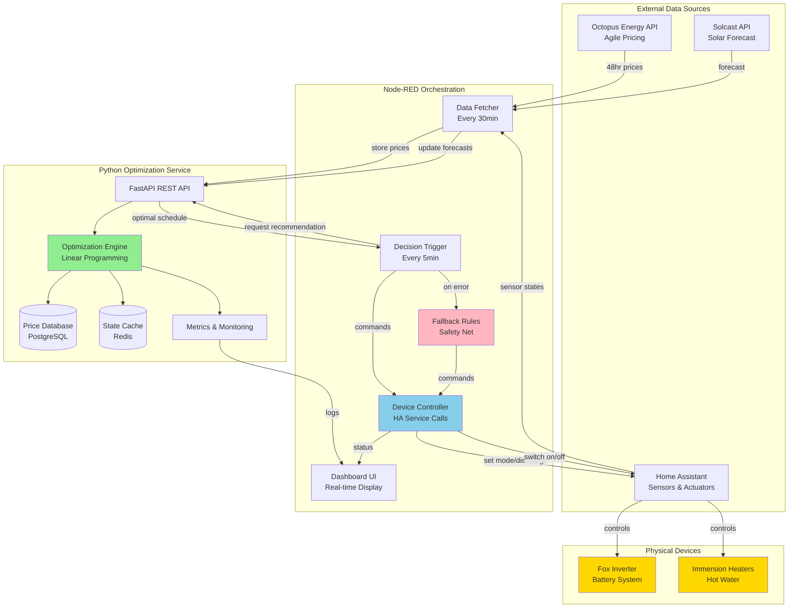
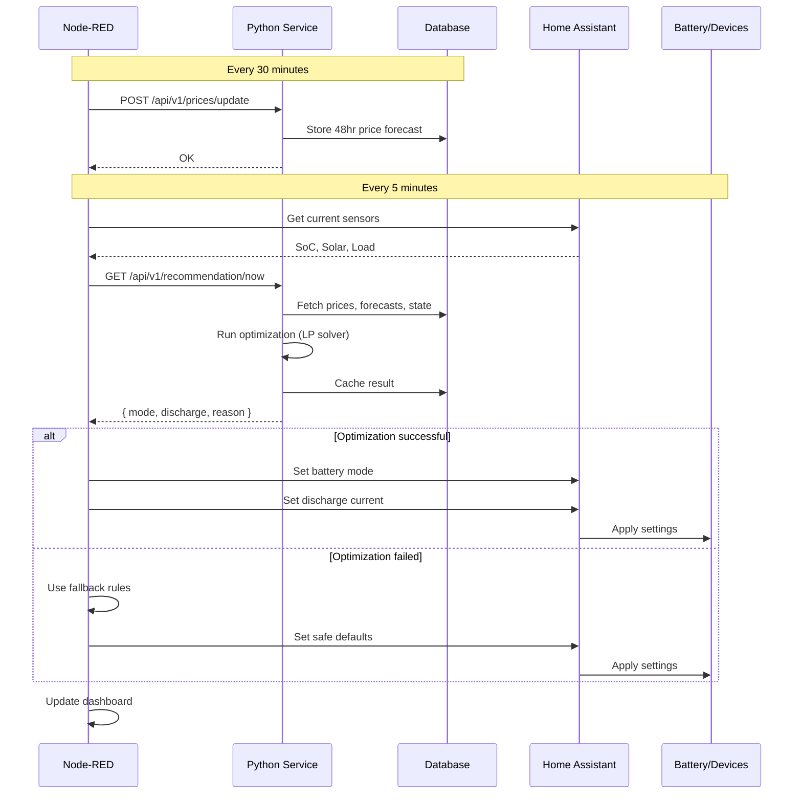
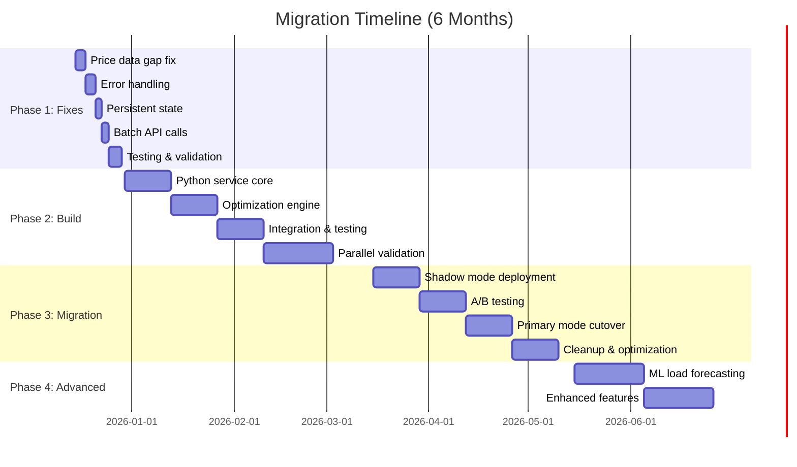
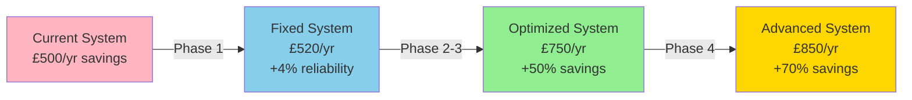

# Recommended Hybrid Architecture - Visual Reference

## System Overview



## Data Flow - Optimization Cycle



## Component Responsibilities

| Component | Responsibilities | Technology |
|-----------|-----------------|------------|
| **Node-RED** | - Orchestration & scheduling<br/>- Home Assistant integration<br/>- Device control execution<br/>- Dashboard UI<br/>- Fallback safety rules | JavaScript, Node-RED nodes |
| **Python Service** | - Mathematical optimization<br/>- Price data management<br/>- State persistence<br/>- Metrics & analytics<br/>- API endpoints | Python 3.11+, FastAPI, PuLP |
| **PostgreSQL** | - Price history (48hr rolling)<br/>- Optimization results<br/>- System configuration<br/>- Audit logs | PostgreSQL 15 |
| **Redis** | - Current state cache<br/>- Fast lookups<br/>- Session data | Redis 7 |
| **Home Assistant** | - Physical device control<br/>- Sensor data collection<br/>- External integrations | HA Core |

## Optimization Algorithm Flow

```mermaid
flowchart TD
    START[Start Optimization] --> GATHER[Gather Inputs]
    GATHER --> INPUTS{Inputs Valid?}
    INPUTS -->|No| ERROR[Return Error]
    INPUTS -->|Yes| BUILD[Build LP Problem]
    
    BUILD --> VARS[Define Variables:<br/>charge[], discharge[], soc[]]
    VARS --> OBJ[Objective Function:<br/>Minimize Total Cost]
    OBJ --> CONST[Add Constraints:<br/>Battery limits, Physics]
    
    CONST --> SOLVE[Solve with PuLP]
    SOLVE --> SOL{Solution Found?}
    
    SOL -->|No| FALLBACK[Use Heuristic Fallback]
    SOL -->|Yes| EXTRACT[Extract Schedule]
    
    EXTRACT --> NOW[Get Current Action]
    FALLBACK --> NOW
    
    NOW --> CACHE[Cache Full Schedule]
    CACHE --> RETURN[Return Recommendation]
    RETURN --> END[End]
    
    style SOLVE fill:#90EE90
    style FALLBACK fill:#FFB6C1
    style RETURN fill:#87CEEB
```

## Migration Phases



## Quick Decision Matrix

| Scenario | Recommended Action |
|----------|-------------------|
| **System working fine, no budget** | Implement Phase 1 fixes only |
| **Want better results, moderate budget** | Full hybrid architecture (all phases) |
| **Need quick wins** | Phase 1 + simple optimization (skip ML) |
| **Large battery (>10kWh), complex tariff** | Full optimization - highest ROI |
| **Small battery (<5kWh), simple tariff** | Improved rules may suffice |
| **Planning to add EV/V2G** | Full hybrid - future-proof |

## Expected Outcomes by Phase



## Key Success Metrics

| Metric | Current | Phase 1 Target | Phase 3 Target |
|--------|---------|----------------|----------------|
| Annual savings | £500 | £520 | £750+ |
| System uptime | 95% | 99% | 99.9% |
| Response latency | 2s | 500ms | 100ms |
| Optimization accuracy | N/A (reactive) | N/A | 95%+ vs theoretical optimal |
| Data gaps | 6hr/day | 0 | 0 |
| Test coverage | 0% | 20% | 80% |

## Technology Stack Summary

```
┌────────────────────────────────────────────────────────┐
│                    FRONTEND LAYER                       │
│  Node-RED Dashboard UI (existing)                       │
│  Optional: React dashboard for advanced features        │
└────────────────────────────────────────────────────────┘
                         ↑ HTTP/WebSocket
┌────────────────────────────────────────────────────────┐
│                 ORCHESTRATION LAYER                     │
│  Node-RED v3.x                                         │
│  - Flow-based orchestration                            │
│  - HA integration nodes                                │
│  - Safety fallback logic                               │
└────────────────────────────────────────────────────────┘
                         ↑ REST API
┌────────────────────────────────────────────────────────┐
│                  BUSINESS LOGIC LAYER                   │
│  Python 3.11+ FastAPI Service                          │
│  - PuLP/CVXPY (optimization)                           │
│  - NumPy/Pandas (data processing)                      │
│  - Pydantic (validation)                               │
│  - APScheduler (background tasks)                      │
└────────────────────────────────────────────────────────┘
                         ↑ SQL/Redis
┌────────────────────────────────────────────────────────┐
│                    DATA LAYER                           │
│  PostgreSQL 15: Persistent storage                     │
│  Redis 7: Fast cache                                   │
│  InfluxDB: Time-series metrics (existing)              │
└────────────────────────────────────────────────────────┘
                         ↑ API Calls
┌────────────────────────────────────────────────────────┐
│                 INTEGRATION LAYER                       │
│  Home Assistant: Device control                        │
│  Octopus Energy API: Pricing                           │
│  Solcast: Solar forecasts                              │
└────────────────────────────────────────────────────────┘
```

## Deployment Architecture

```
Host Machine (Raspberry Pi 4 / NUC / Server)
│
├── Docker Compose Stack
│   ├── Node-RED Container (port 1880)
│   ├── Python Service Container (port 8000)
│   ├── PostgreSQL Container (port 5432)
│   ├── Redis Container (port 6379)
│   └── InfluxDB Container (existing, port 8086)
│
├── Home Assistant (separate install or container)
│
└── Shared Volumes
    ├── /data/nodered (flows, context)
    ├── /data/postgres (database files)
    └── /data/config (shared configs)
```

---

**Version:** 1.0  
**Last Updated:** 2025-12-10  
**For:** Hybrid Architecture Implementation  
**Status:** ✅ Ready for Review