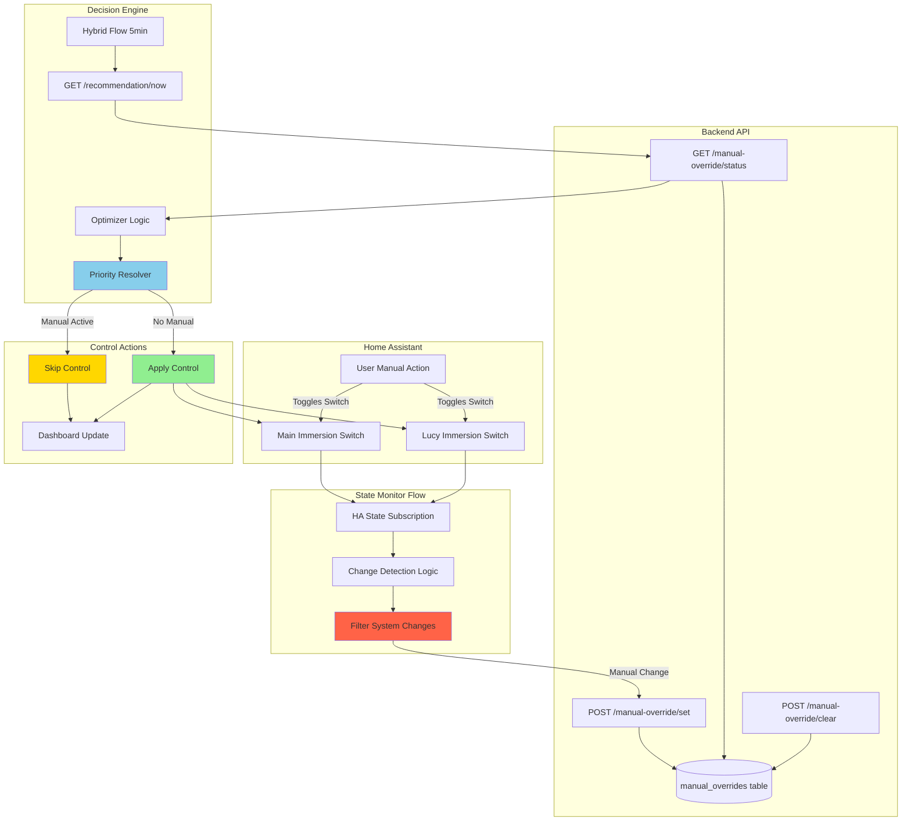
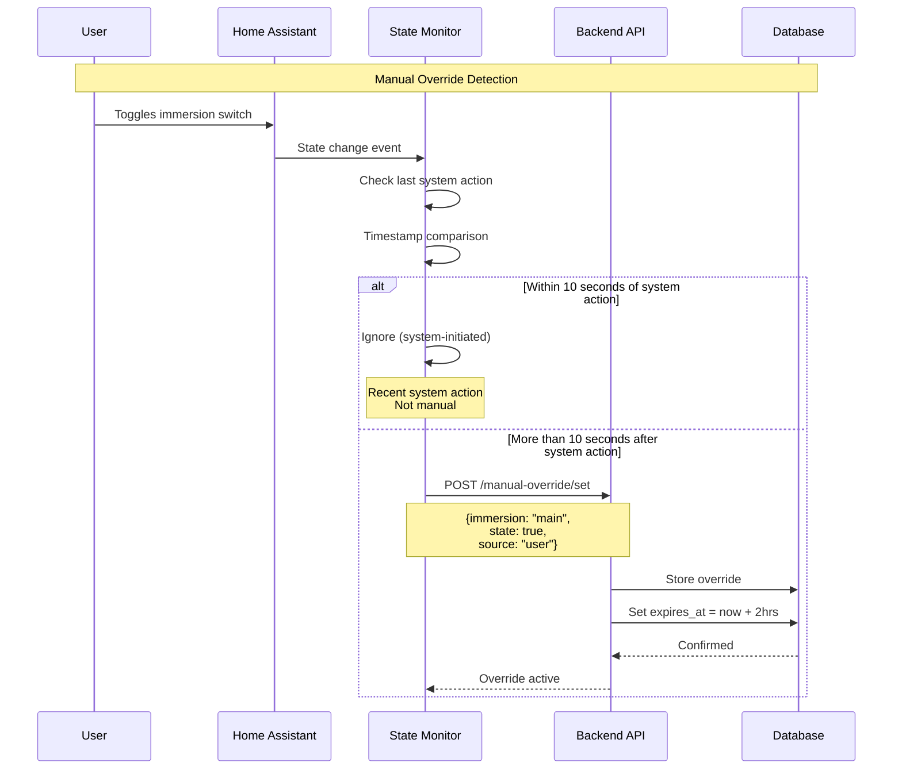

# Manual Override Architecture for Immersion Control

## Overview

This architecture solves the problem of manual immersion heater control being overwritten by automated systems. It introduces a **3-tier priority system** where manual user actions take precedence over scheduled and price-based automation.

## Problem Statement

**Current Issue:**
- User manually turns immersion switch ON/OFF in Home Assistant
- After 5 minutes, the hybrid flow runs and overwrites the manual state
- System has no way to distinguish between its own actions and user actions

**Required Solution:**
- Detect when user manually changes immersion switch state
- Store manual override with 2-hour expiry
- Respect manual override in all automated decision-making
- Provide clear visual feedback and manual control resumption

## Control Priority Hierarchy

```
┌─────────────────────────────────────────┐
│  PRIORITY 1: MANUAL OVERRIDE            │
│  ├─ Detected via HA state changes       │
│  ├─ Duration: 2 hours (configurable)    │
│  ├─ Indicator: Yellow status            │
│  └─ Clear: "Resume Auto" button         │
└─────────────────────────────────────────┘
           ↓ (if no manual override)
┌─────────────────────────────────────────┐
│  PRIORITY 2: SCHEDULE OVERRIDE          │
│  ├─ Time-based schedules                │
│  ├─ Temperature-based triggers          │
│  ├─ Indicator: Orange status            │
│  └─ Duration: Until schedule ends       │
└─────────────────────────────────────────┘
           ↓ (if no schedule active)
┌─────────────────────────────────────────┐
│  PRIORITY 3: OPTIMIZER LOGIC            │
│  ├─ Price-based decisions               │
│  ├─ SOC-based decisions                 │
│  ├─ Solar-based decisions               │
│  ├─ Indicator: Green status             │
│  └─ Duration: Continuous optimization   │
└─────────────────────────────────────────┘
```

## System Architecture

### Data Flow Diagram



### State Detection Logic



## Database Schema Extension

### New Table: `manual_overrides`

```sql
CREATE TABLE manual_overrides (
    id INT PRIMARY KEY AUTO_INCREMENT,
    immersion_name VARCHAR(50) NOT NULL,  -- 'main' or 'lucy'
    is_active BOOLEAN NOT NULL DEFAULT TRUE,
    desired_state BOOLEAN NOT NULL,  -- ON=true, OFF=false
    source VARCHAR(50) DEFAULT 'user',  -- 'user', 'dashboard', 'api'
    created_at DATETIME NOT NULL DEFAULT CURRENT_TIMESTAMP,
    expires_at DATETIME NOT NULL,  -- Auto-set to created_at + 2 hours
    cleared_at DATETIME NULL,
    cleared_by VARCHAR(50) NULL,  -- 'user', 'system_expiry', 'api'
    
    INDEX idx_active_immersion (immersion_name, is_active, expires_at),
    INDEX idx_expires (expires_at)
);
```

### Updated `OptimizationResult` Table

Add fields to track override status:

```sql
ALTER TABLE optimization_results ADD COLUMN:
    manual_override_main BOOLEAN DEFAULT FALSE,
    manual_override_lucy BOOLEAN DEFAULT FALSE,
    manual_override_main_expires DATETIME NULL,
    manual_override_lucy_expires DATETIME NULL
```

## API Endpoints

### 1. Set Manual Override

**Endpoint:** `POST /api/v1/manual-override/set`

**Request Body:**
```json
{
  "immersion_name": "main",
  "desired_state": true,
  "source": "user",
  "duration_hours": 2
}
```

**Response:**
```json
{
  "status": "success",
  "message": "Manual override set for 'main' immersion",
  "override_id": 123,
  "expires_at": "2025-12-10T20:48:00Z",
  "current_state": true
}
```

### 2. Get Override Status

**Endpoint:** `GET /api/v1/manual-override/status`

**Response:**
```json
{
  "status": "success",
  "overrides": {
    "main": {
      "is_active": true,
      "desired_state": true,
      "expires_at": "2025-12-10T20:48:00Z",
      "time_remaining_minutes": 115,
      "source": "user"
    },
    "lucy": {
      "is_active": false,
      "desired_state": null,
      "expires_at": null,
      "time_remaining_minutes": 0,
      "source": null
    }
  },
  "any_active": true
}
```

### 3. Clear Manual Override

**Endpoint:** `POST /api/v1/manual-override/clear`

**Request Body:**
```json
{
  "immersion_name": "main",
  "cleared_by": "user"
}
```

**Response:**
```json
{
  "status": "success",
  "message": "Manual override cleared for 'main' immersion",
  "system_resuming_control": true
}
```

### 4. Clear All Overrides

**Endpoint:** `POST /api/v1/manual-override/clear-all`

**Response:**
```json
{
  "status": "success",
  "cleared_count": 2,
  "message": "All manual overrides cleared"
}
```

## Node-RED Flows

### Flow 1: State Change Monitor

**Purpose:** Detect manual switch changes and report to API

**Trigger:** HA state change event for immersion switches

**Logic:**
```javascript
// Store last system action timestamp in flow context
const lastSystemAction = flow.get('last_system_action_' + immersion) || 0;
const now = Date.now();
const changeSource = msg.event.context?.user_id ? 'user' : 'system';

// If change happened within 10 seconds of system action, ignore
if (now - lastSystemAction < 10000 && changeSource === 'system') {
    // System-initiated change, ignore
    return null;
}

// Manual change detected
if (changeSource === 'user') {
    // Report to API
    msg.payload = {
        immersion_name: immersion,
        desired_state: msg.payload === 'on',
        source: 'user',
        duration_hours: 2
    };
    return msg;
}
```

**Nodes:**
1. `events: state` - Subscribe to switch state changes
2. `function` - Detection logic above
3. `http request` - POST to `/manual-override/set`
4. `debug` - Log override creation

### Flow 2: Enhanced Hybrid Flow

**Changes to existing hybrid flow:**

**Before applying control:**
1. Query manual override status
2. Check each immersion independently
3. Skip control if manual override active
4. Update dashboard with override status

**Pseudo-code:**
```javascript
// Get override status
const overrideStatus = await getManualOverrideStatus();

// Process recommendation
const rec = msg.payload;

// For main immersion
if (overrideStatus.main.is_active) {
    // Manual override active - use manual state
    msg.payload.immersion_main = overrideStatus.main.desired_state;
    msg.payload.immersion_main_source = 'manual_override';
    msg.payload.immersion_main_reason = `Manual override (${overrideStatus.main.time_remaining_minutes}min remaining)`;
} else {
    // No manual override - use recommendation
    // (existing logic)
}

// Same for lucy immersion
// ...

// Update system action timestamp
flow.set('last_system_action_main', Date.now());
flow.set('last_system_action_lucy', Date.now());
```

### Flow 3: Dashboard Controls

**New Dashboard Elements:**

1. **Override Status Indicators**
   - Show yellow light for active overrides
   - Display time remaining
   - Auto-update every 30 seconds

2. **"Resume Auto" Buttons**
   - One for each immersion
   - Only enabled when override active
   - Calls `/manual-override/clear`

## Optimizer Integration

### Enhanced Recommendation Logic

```python
def optimize_schedule(
    self,
    current_soc: float,
    prices: List[Dict],
    solar_forecast: List[float],
    schedule_status: Optional[Dict] = None,
    manual_override_status: Optional[Dict] = None  # NEW
) -> Dict:
    """
    Priority resolution:
    1. Check manual_override_status
    2. Check schedule_status
    3. Use optimizer logic
    """
    
    # PRIORITY 1: Manual Override
    immersion_main_source = "optimizer"
    immersion_lucy_source = "optimizer"
    
    if manual_override_status:
        if manual_override_status.get('main', {}).get('is_active'):
            immersion_main = manual_override_status['main']['desired_state']
            immersion_main_source = "manual_override"
            immersion_main_reason = f"Manual override ({manual_override_status['main']['time_remaining_minutes']}min left)"
            manual_override_active = True
        else:
            # Check PRIORITY 2: Schedule
            if schedule_status and schedule_status.get('main', {}).get('is_active'):
                # ... existing schedule logic
            else:
                # PRIORITY 3: Optimizer
                # ... existing optimizer logic
    
    # Same for lucy immersion
    # ...
```

## Expiry Mechanism

### Background Task (runs every 5 minutes)

```python
@app.task
async def expire_manual_overrides():
    """
    Cleanup expired manual overrides
    Runs every 5 minutes via scheduler
    """
    now = datetime.now()
    
    with get_db_session() as db:
        expired_overrides = db.query(ManualOverride).filter(
            and_(
                ManualOverride.is_active == True,
                ManualOverride.expires_at <= now
            )
        ).all()
        
        for override in expired_overrides:
            override.is_active = False
            override.cleared_at = now
            override.cleared_by = 'system_expiry'
            logger.info(f"Auto-expired manual override for {override.immersion_name}")
        
        db.commit()
        
        return len(expired_overrides)
```

### Node-RED Timer

Alternative: Check expiry in Node-RED before each control action

```javascript
function checkExpiry(overrideStatus) {
    const now = new Date();
    
    for (const [immersion, status] of Object.entries(overrideStatus)) {
        if (status.is_active && status.expires_at) {
            const expiresAt = new Date(status.expires_at);
            if (now >= expiresAt) {
                // Override expired, clear it
                clearManualOverride(immersion);
            }
        }
    }
}
```

## Dashboard Design

### Override Status Widget

```
┌─────────────────────────────────────────────┐
│  Main Immersion                             │
│  ● MANUAL OVERRIDE ACTIVE                   │
│  State: ON | Expires in: 1h 45m            │
│  [Resume Auto Control]                      │
└─────────────────────────────────────────────┘

┌─────────────────────────────────────────────┐
│  Lucy Immersion                             │
│  ● SCHEDULE CONTROL                         │
│  State: OFF | Next: Tomorrow 9:00 AM       │
│  [No Override Active]                       │
└─────────────────────────────────────────────┘
```

### Status Colors

- 🔴 **Red**: Error/disconnected
- 🟡 **Yellow**: Manual override active
- 🟠 **Orange**: Schedule override active
- 🟢 **Green**: Optimizer control (normal)
- ⚪ **Gray**: System off/disabled

## Implementation Phases

### Phase 1: Backend Foundation (Day 1)
- [x] Create `manual_overrides` table schema
- [x] Add SQLAlchemy model
- [x] Create API endpoints (set, status, clear)
- [x] Add expiry background task
- [x] Update optimizer priority logic

### Phase 2: State Detection (Day 1-2)
- [ ] Create HA state subscription flow
- [ ] Implement change detection logic
- [ ] Add last-action timestamp tracking
- [ ] Test manual vs system differentiation

### Phase 3: Control Integration (Day 2)
- [ ] Update hybrid flow recommendation processor
- [ ] Add override status query before control
- [ ] Implement priority resolution
- [ ] Update system action timestamps

### Phase 4: Dashboard (Day 2-3)
- [ ] Add override status indicators
- [ ] Create "Resume Auto" buttons
- [ ] Add countdown timers
- [ ] Color-code control sources

### Phase 5: Testing (Day 3)
- [ ] Test manual switch toggle detection
- [ ] Verify 2-hour expiry works
- [ ] Test "Resume Auto" button
- [ ] Verify priority hierarchy
- [ ] Edge case testing

## Example Scenarios

### Scenario 1: Manual Override During Cheap Period

```
Time: 14:00
Price: 2p/kWh (very cheap)
SOC: 98%
Optimizer Decision: Immersion ON (cheap + full battery)

User Action: Manually turns OFF main immersion

System Response:
1. Detect manual change (14:00:05)
2. Create override: Main=OFF, expires 16:00
3. Next cycle (14:05): Skip control, keep OFF
4. Dashboard shows: "Manual Override Active (1h 55m)"
5. At 16:00:30: Override expires, optimizer resumes
6. Optimizer: Checks price (now 15p), keeps OFF
```

### Scenario 2: Override During Schedule

```
Time: 15:00 Wednesday
Schedule: Wed 15:00-17:00 (Immersion ON)
Manual Override: User turned OFF at 15:30

Priority Order:
1. Manual Override: OFF (expires 17:30) ✅ WINS
2. Schedule: ON (active until 17:00) ❌
3. Optimizer: Would be OFF (SOC 45%, price 20p) ❌

Result: Immersion stays OFF until 17:30 (override expires)
```

### Scenario 3: Clear Override Early

```
Time: 14:30
Manual Override: Set at 14:00, expires 16:00
User Action: Clicks "Resume Auto"

System Response:
1. Call /manual-override/clear
2. Mark override as cleared by 'user'
3. Next cycle (14:35): Check priorities
4. No manual override → Check schedule
5. No schedule → Use optimizer logic
6. Optimizer decides based on current conditions
```

## Error Handling

### Failed Override Detection
- **Cause**: HA state event not received
- **Fallback**: User can manually set override via dashboard
- **Recovery**: Background task checks for orphaned switches

### Database Connectivity Loss
- **Cause**: MariaDB connection failure
- **Fallback**: Store overrides in Node-RED flow context
- **Recovery**: Sync to database when connection restored

### Expired Override Not Cleared
- **Cause**: Background task failure
- **Fallback**: Check expiry in hybrid flow
- **Recovery**: Clear on next control cycle

## Testing Checklist

- [ ] Manual switch toggle detected within 5 seconds
- [ ] System switch change ignored (within 10s of action)
- [ ] Override stored with correct expiry (2 hours)
- [ ] Hybrid flow respects manual override
- [ ] Optimizer recommendation includes override status
- [ ] Dashboard shows yellow indicator
- [ ] Countdown timer updates correctly
- [ ] "Resume Auto" button clears override
- [ ] Expiry happens automatically after 2 hours
- [ ] Priority order: Manual > Schedule > Optimizer
- [ ] Multiple overrides (main + lucy) work independently
- [ ] Override survives system restart (in database)

## Performance Considerations

| Metric | Target | Notes |
|--------|--------|-------|
| Override Detection Latency | <5s | HA event → API call |
| Database Write Time | <50ms | Insert override record |
| Status Query Time | <20ms | Check active overrides |
| Expiry Check Overhead | <100ms | Every 5 min background |
| Dashboard Update Delay | <2s | Override status display |

## Future Enhancements

1. **Configurable Duration**: Let user choose override duration (30min, 1hr, 2hr, 4hr)
2. **Override History**: Track all manual overrides for analytics
3. **Smart Expiry**: Extend override if user keeps interacting
4. **Voice Control**: "Alexa, override immersion for 2 hours"
5. **Mobile Notifications**: Alert when override about to expire
6. **Schedule Exceptions**: "Override schedule just for today"
7. **Machine Learning**: Learn user manual override patterns

---

**Total Implementation Time:** 3-4 days  
**Complexity:** Medium-High  
**Risk Level:** Low (backward compatible, adds new functionality)  
**User Impact:** High (solves critical user pain point)