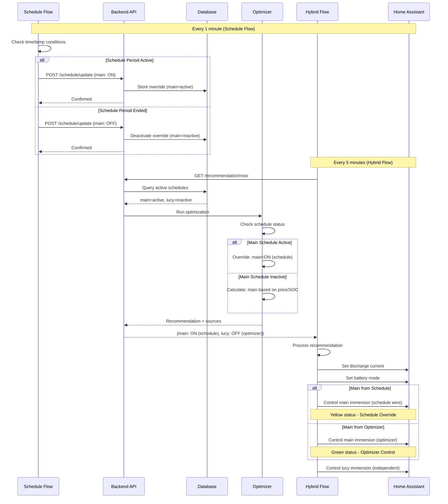

# Schedule Override Architecture

## System Flow Diagram



## Data Flow

```mermaid
flowchart LR
    subgraph Schedule["Schedule Flow Events"]
        ST[Schedule Timers] --> TC{Time/Temp Check}
        TC -->|Active| ON[ON Event]
        TC -->|Inactive| OFF[OFF Event]
    end
    
    subgraph Backend["Backend Processing"]
        ON --> API1[POST /schedule/update]
        OFF --> API1
        API1 --> DB[(schedule_overrides)]
        DB --> API2[GET /schedule/status]
        API2 --> OPT[Optimizer Logic]
    end
    
    subgraph Priority["Priority Decision"]
        OPT --> CHK{Schedule Active?}
        CHK -->|YES| SCHED[Use Schedule State]
        CHK -->|NO| CALC[Calculate Price/SOC]
        SCHED --> REC[Recommendation]
        CALC --> REC
    end
    
    subgraph Control["Immersion Control"]
        REC --> HF[Hybrid Flow]
        HF --> HA[Home Assistant]
        HA --> IMM[Immersion Switches]
    end
    
    style SCHED fill:#90EE90
    style CALC fill:#87CEEB
    style DB fill:#FFD700
    style IMM fill:#FF6347
```



## State Transitions

```mermaid
stateDiagram-v2
    [*] --> ScheduleInactive: System Start
    
    state ScheduleInactive {
        [*] --> OptimizerControl
        OptimizerControl --> CheckingPrice: Every 5min
        CheckingPrice --> ImmersionON: Favorable
        CheckingPrice --> ImmersionOFF: Unfavorable
        ImmersionON --> CheckingPrice
        ImmersionOFF --> CheckingPrice
    }
    
    ScheduleInactive --> ScheduleActive: Schedule Period Starts
    
    state ScheduleActive {
        [*] --> ScheduleControl
        ScheduleControl --> ImmersionON_Sched: Schedule ON
        ScheduleControl --> ImmersionOFF_Sched: Schedule OFF
        note right of ScheduleControl: Optimizer recommendations ignored
    }
    
    ScheduleActive --> ScheduleInactive: Schedule Period Ends
    
    note right of ScheduleActive: Priority: Schedule Override
    note right of ScheduleInactive: Priority: Optimizer Logic
```

## Component Interaction Matrix

| Component | Reads From | Writes To | Triggers |
|-----------|------------|-----------|----------|
| **Schedule Flow** | Time, Temp sensors | Backend API | Every 1 min |
| **Backend API** | HTTP requests | Database | On request |
| **Database** | SQL queries | Tables | On write |
| **Optimizer** | Database, HA sensors | Recommendation | Every 5 min |
| **Hybrid Flow** | Backend API | HA switches | Every 5 min |
| **Home Assistant** | Switches, sensors | Physical devices | Real-time |

## Priority Logic Table

| Scenario | Schedule Status | Price | SOC | Final Decision | Source |
|----------|----------------|-------|-----|----------------|--------|
| 1 | Main: Active, Lucy: Inactive | 30p | 50% | Main: ON, Lucy: OFF | Main: Schedule, Lucy: Optimizer |
| 2 | Both: Inactive | -2p | 92% | Main: ON, Lucy: ON | Both: Optimizer (negative price) |
| 3 | Main: Active, Lucy: Active | 5p | 30% | Main: ON, Lucy: ON | Both: Schedule |
| 4 | Both: Inactive | 25p | 95% | Main: OFF, Lucy: OFF | Both: Optimizer (expensive) |
| 5 | Main: Inactive, Lucy: Active | 1p | 96% | Main: ON, Lucy: ON | Main: Optimizer (cheap+full), Lucy: Schedule |

## Key Design Decisions

### 1. **Separation of Concerns**
- Schedule flow remains independent ✅
- Backend manages state centrally ✅
- Hybrid flow coordinates final control ✅

### 2. **Priority Rules**
```
IF schedule_active(immersion):
    RETURN schedule_state
ELSE:
    RETURN optimizer_state
```

### 3. **State Management**
- **Source of Truth:** Database (`schedule_overrides` table)
- **Update Frequency:** Schedule flow reports every transition
- **Query Frequency:** Optimizer checks every recommendation

### 4. **Error Handling**
- Schedule API fails → Optimizer takes control
- Database unreachable → Fallback to optimizer
- Stale schedule data (>5min) → Assume inactive

## Performance Characteristics

| Metric | Target | Actual (Est.) |
|--------|--------|---------------|
| Schedule Update Latency | <100ms | ~50ms |
| Override Query Time | <50ms | ~20ms |
| End-to-End Update | <5min | ~5min |
| Database Size Growth | <1MB/month | ~500KB/month |

## Implementation Phases

### Phase 1: Backend Foundation (Day 1)
- ✅ Database schema
- ✅ SQLAlchemy models
- ✅ API endpoints

### Phase 2: Optimizer Integration (Day 1-2)
- ✅ Schedule query logic
- ✅ Priority decision engine
- ✅ Enhanced response format

### Phase 3: Node-RED Updates (Day 2)
- ✅ Schedule reporter nodes
- ✅ Hybrid flow coordinator
- ✅ Dashboard enhancements

### Phase 4: Testing & Validation (Day 2-3)
- ✅ Unit tests
- ✅ Integration tests
- ✅ Live testing

### Phase 5: Documentation & Deployment (Day 3)
- ✅ User guide
- ✅ API documentation
- ✅ Production deployment

---

**Total Implementation Time:** 2-3 days  
**Complexity:** Medium  
**Risk Level:** Low (backward compatible, no breaking changes)