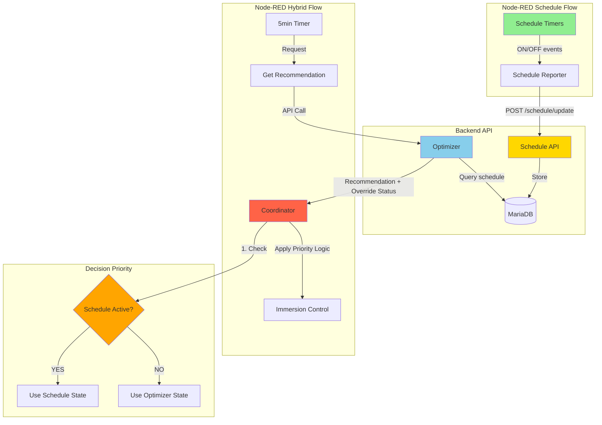

# Schedule Override Implementation Plan

**Version:** 1.0  
**Date:** 2025-12-10  
**Approach:** Backend API Integration with Database Logging

---

## 🎯 Objective

Integrate the existing Node-RED immersion schedule flow with the hybrid battery optimizer system, ensuring **schedule always takes priority** over price/SOC-based control.

---

## 📐 Architecture Overview



---

## 🗄️ Database Schema

### New Table: `schedule_overrides`

```sql
CREATE TABLE schedule_overrides (
    id INT AUTO_INCREMENT PRIMARY KEY,
    immersion_name VARCHAR(50) NOT NULL,  -- 'main' or 'lucy'
    is_active BOOLEAN NOT NULL DEFAULT FALSE,
    schedule_reason VARCHAR(200),  -- e.g., 'Time-based schedule: Wed 15:00-17:00'
    activated_at TIMESTAMP,
    deactivated_at TIMESTAMP NULL,
    created_at TIMESTAMP DEFAULT CURRENT_TIMESTAMP,
    updated_at TIMESTAMP DEFAULT CURRENT_TIMESTAMP ON UPDATE CURRENT_TIMESTAMP,
    
    INDEX idx_immersion_active (immersion_name, is_active),
    INDEX idx_activated (activated_at)
);

-- Ensure only one active schedule per immersion at a time
CREATE UNIQUE INDEX idx_unique_active 
ON schedule_overrides (immersion_name, is_active) 
WHERE is_active = TRUE;
```

### Purpose:
- **Track schedule override status** in real-time
- **Historical logging** of when schedules were active
- **Audit trail** for debugging and optimization analysis

---

## 🔌 Backend API Endpoints

### 1. POST `/api/v1/schedule/update`

**Purpose:** Schedule flow reports when it turns ON/OFF

**Request Body:**
```json
{
    "immersion_name": "main",  // or "lucy"
    "is_active": true,         // true = schedule ON, false = schedule OFF
    "schedule_reason": "Time-based: Wed 15:00-17:00",
    "timestamp": "2025-12-10T15:00:00Z"
}
```

**Response:**
```json
{
    "status": "success",
    "message": "Schedule override for 'main' immersion set to active",
    "override_id": 123,
    "effective_until": null  // Future: could add expiry
}
```

**Logic:**
1. Deactivate any existing active override for this immersion
2. Create new schedule override record
3. Return confirmation

---

### 2. GET `/api/v1/schedule/status`

**Purpose:** Check current schedule override status for all immersions

**Response:**
```json
{
    "status": "success",
    "schedules": {
        "main": {
            "is_active": true,
            "schedule_reason": "Time-based: Wed 15:00-17:00",
            "activated_at": "2025-12-10T15:00:00Z",
            "duration_minutes": 45
        },
        "lucy": {
            "is_active": false,
            "schedule_reason": null,
            "activated_at": null,
            "duration_minutes": 0
        }
    },
    "any_active": true
}
```

---

### 3. GET `/api/v1/schedule/history`

**Purpose:** Historical view of schedule activations (for analysis)

**Query Parameters:**
- `immersion_name` (optional): "main" or "lucy"
- `start_date` (optional): ISO 8601 date
- `end_date` (optional): ISO 8601 date
- `limit` (optional): max records (default 100)

**Response:**
```json
{
    "status": "success",
    "history": [
        {
            "id": 123,
            "immersion_name": "main",
            "is_active": false,
            "schedule_reason": "Time-based: Wed 15:00-17:00",
            "activated_at": "2025-12-10T15:00:00Z",
            "deactivated_at": "2025-12-10T17:00:00Z",
            "duration_minutes": 120
        }
    ],
    "total_records": 1
}
```

---

## ⚙️ Optimizer Changes

### Current Flow:
```python
# optimizer.py - lines 178-194
if current_price < 0 and current_soc >= 90:
    immersion_main = True
    immersion_lucy = True
elif current_price < 2 and current_soc >= 95:
    immersion_main = True
    immersion_lucy = True
elif solar_forecast[0] > 5.0 and current_soc >= 95:
    immersion_main = True
```

### New Flow with Schedule Override:

```python
# optimizer.py - New section
# Check for schedule overrides FIRST
schedule_status = get_schedule_status()  # Query database
schedule_main = schedule_status.get('main', {}).get('is_active', False)
schedule_lucy = schedule_status.get('lucy', {}).get('is_active', False)

# Determine immersion status with priority:
# Priority 1: Schedule (if active)
# Priority 2: Price/SOC optimizer logic
if schedule_main:
    immersion_main = True
    immersion_main_reason = schedule_status['main']['schedule_reason']
    immersion_main_source = "schedule_override"
else:
    # Original optimizer logic
    if current_price < 0 and current_soc >= 90:
        immersion_main = True
        immersion_main_reason = f"Negative price ({current_price:.1f}p) + High SOC"
        immersion_main_source = "optimizer"
    # ... rest of logic

# Same for Lucy immersion
if schedule_lucy:
    immersion_lucy = True
    immersion_lucy_reason = schedule_status['lucy']['schedule_reason']
    immersion_lucy_source = "schedule_override"
else:
    # Optimizer logic for Lucy
    # ...
```

### Return Enhanced Response:

```python
result = {
    "status": "optimal",
    "current_recommendation": {
        "mode": mode,
        "discharge_current": discharge_current,
        "immersion_main": immersion_main,
        "immersion_main_source": immersion_main_source,  # NEW
        "immersion_main_reason": immersion_main_reason,  # Enhanced
        "immersion_lucy": immersion_lucy,
        "immersion_lucy_source": immersion_lucy_source,  # NEW
        "immersion_lucy_reason": immersion_lucy_reason,  # Enhanced
        "schedule_override_active": schedule_main or schedule_lucy  # NEW
    }
}
```

---

## 🔄 Node-RED Flow Changes

### 1. Update Schedule Flow

**Add Schedule Reporter nodes after each schedule:**

```javascript
// New function node: "Report Main Schedule Status"
const immersion_name = "main";
const is_active = (msg.payload === "ON");
const schedule_reason = is_active ? 
    "Time schedule: " + flow.get('current_schedule_period') :
    "Schedule period ended";

msg.payload = {
    immersion_name: immersion_name,
    is_active: is_active,
    schedule_reason: schedule_reason,
    timestamp: new Date().toISOString()
};

return msg;
```

**Connect to HTTP Request node:**
- Method: POST
- URL: `http://192.168.1.60:8000/api/v1/schedule/update`
- Return: Parsed JSON

---

### 2. Update Hybrid Flow

**Modify "Process Recommendation" function:**

```javascript
// Process Recommendation - UPDATED
const rec = msg.payload;

if (!rec || !rec.mode || rec.discharge_current === undefined) {
    node.error('Invalid recommendation received');
    return null;
}

flow.set('current_recommendation', rec);

// NEW: Check if schedule override is active
const scheduleActive = rec.schedule_override_active || false;
const mainSource = rec.immersion_main_source || 'optimizer';
const lucySource = rec.immersion_lucy_source || 'optimizer';

// Status indicators
const immStatusMain = rec.immersion_main ? 
    `MAIN-ON [${mainSource}]` : 
    `MAIN-OFF [${mainSource}]`;
const immStatusLucy = rec.immersion_lucy ? 
    `LUCY-ON [${lucySource}]` : 
    `LUCY-OFF [${lucySource}]`;

node.status({
    fill: scheduleActive ? 'yellow' : 
          (rec.optimization_status === 'optimal' ? 'green' : 'blue'),
    shape: 'dot',
    text: `${rec.mode} | ${rec.discharge_current}A | ${immStatusMain} | ${immStatusLucy}`
});

// Log with source information
node.log(
    `Recommendation: ${rec.mode} at ${rec.discharge_current}A\n` +
    `Main Immersion: ${rec.immersion_main} (${mainSource}) - ${rec.immersion_main_reason}\n` +
    `Lucy Immersion: ${rec.immersion_lucy} (${lucySource}) - ${rec.immersion_lucy_reason}`
);

// Return outputs (same structure as before)
return [
    { payload: { value: rec.discharge_current } },
    { payload: { mode: rec.mode } },
    { payload: rec.immersion_main, entity_id: 'switch.immersion_switch' },
    { payload: rec.immersion_lucy, entity_id: 'switch.immersion_lucy_switch' }
];
```

---

### 3. Enhanced Dashboard

**Add new dashboard widgets:**

```javascript
// Format Dashboard - UPDATED
const state = msg.payload;
const rec = flow.get('current_recommendation') || {};

// NEW: Schedule override indicator
const scheduleStatus = rec.schedule_override_active ? 
    '🔒 SCHEDULE OVERRIDE ACTIVE' : 
    '⚡ OPTIMIZER CONTROL';

return [
    { payload: `${rec.mode || 'Unknown'}` },
    { payload: `${state.battery_soc}% SoC` },
    { payload: `${state.solar_power_kw.toFixed(1)}kW` },
    { payload: state.current_price ? `${state.current_price.toFixed(2)}p/kWh` : 'N/A' },
    { payload: scheduleStatus },  // NEW
    { payload: rec.immersion_main_reason || 'N/A' },  // Enhanced
    { payload: rec.immersion_lucy_reason || 'N/A' },  // Enhanced
    { payload: new Date().toLocaleTimeString() }
];
```

---

## 🧪 Testing Scenarios

### Scenario 1: Schedule Takes Priority
**Setup:**
- Current time: Wednesday 15:30 (schedule active)
- Current price: 30p (expensive)
- Battery SOC: 45%

**Expected Behavior:**
- Schedule reports: `immersion_main = ON`
- Optimizer would normally say: `immersion_main = OFF` (SOC too low, price expensive)
- **Final decision: immersion_main = ON** (schedule wins)

### Scenario 2: Schedule Inactive, Optimizer Controls
**Setup:**
- Current time: Wednesday 17:05 (schedule ended)
- Current price: -2p (negative pricing!)
- Battery SOC: 92%

**Expected Behavior:**
- Schedule reports: `immersion_main = OFF`
- Optimizer says: `immersion_main = ON` (negative price + high SOC)
- **Final decision: immersion_main = ON** (optimizer wins)

### Scenario 3: Schedule Ends Mid-Period
**Setup:**
- Time 16:55: Schedule active, immersion ON
- Time 17:01: Schedule ends
- Price: 25p, SOC: 50%

**Expected Behavior:**
- 16:55: Immersion ON (schedule)
- 17:01: Schedule posts deactivation
- 17:05: Next optimizer run -> Immersion OFF (no favorable conditions)
- **Smooth handover with <5min transition**

### Scenario 4: Both Immersions Different Sources
**Setup:**
- Main immersion: Schedule active (ON)
- Lucy immersion: Schedule inactive, but optimizer says ON (cheap price)

**Expected Behavior:**
- Main: ON (schedule override)
- Lucy: ON (optimizer control)
- **Sources tracked independently**

---

## 📊 Monitoring & Logging

### Backend Logs
```
[INFO] Schedule override activated: main immersion (Time-based: Wed 15:00-17:00)
[INFO] Optimizer recommendation: main=ON (schedule_override), lucy=OFF (optimizer)
[INFO] Schedule override deactivated: main immersion (Duration: 120 minutes)
```

### Dashboard Display
```
Current Strategy: Self Use | 30A
Schedule Status: 🔒 SCHEDULE OVERRIDE ACTIVE
Main Immersion: ON [schedule] - Time schedule: Wed 15:00-17:00
Lucy Immersion: OFF [optimizer] - Price too high (25.3p)
```

---

## 🚀 Implementation Order

1. **Backend Database:** Create `schedule_overrides` table
2. **Backend API:** Implement 3 new endpoints
3. **Backend Optimizer:** Add schedule query logic
4. **Node-RED Schedule:** Add reporter nodes
5. **Node-RED Hybrid:** Update coordinator logic
6. **Dashboard:** Add override indicators
7. **Testing:** Run all scenarios
8. **Documentation:** Update user guide

---

## 📝 Configuration Options

### Environment Variables (backend/.env)
```env
# Schedule Override Settings
SCHEDULE_OVERRIDE_ENABLED=true
SCHEDULE_OVERRIDE_LOG_LEVEL=INFO
SCHEDULE_OVERRIDE_HISTORY_DAYS=30  # How long to keep history
```

### Node-RED Settings
- Schedule reporting can be enabled/disabled per immersion
- Fallback behavior if backend unreachable

---

## 🔐 Safety Features

1. **Database constraint:** Only one active schedule per immersion
2. **Stale detection:** If schedule not updated in 5min, assume inactive
3. **Fallback:** If schedule API fails, optimizer takes control
4. **Manual override:** Dashboard button to temporarily disable schedule
5. **Logging:** All decisions logged for audit

---

## 🎯 Success Criteria

✅ Schedule always takes priority when active  
✅ Smooth transition when schedule ends  
✅ Independent control per immersion  
✅ Full logging and monitoring  
✅ No control conflicts  
✅ <100ms API response time  
✅ Dashboard shows clear status

---

## 📚 Next Steps

Ready to proceed? Review this plan and confirm:

1. Database schema acceptable?
2. API endpoint design ok?
3. Priority logic clear?
4. Testing scenarios comprehensive?

Once approved, I'll switch to **Code mode** to implement this solution.